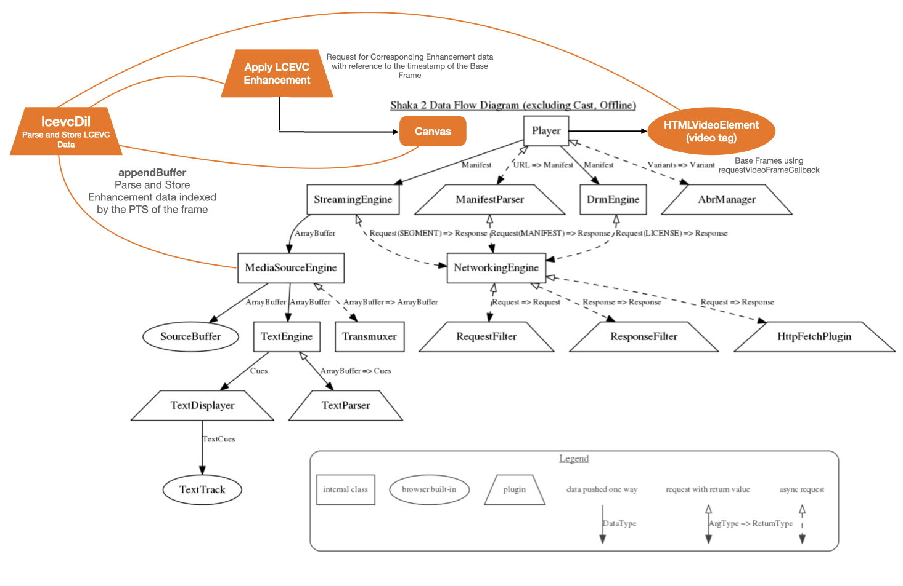
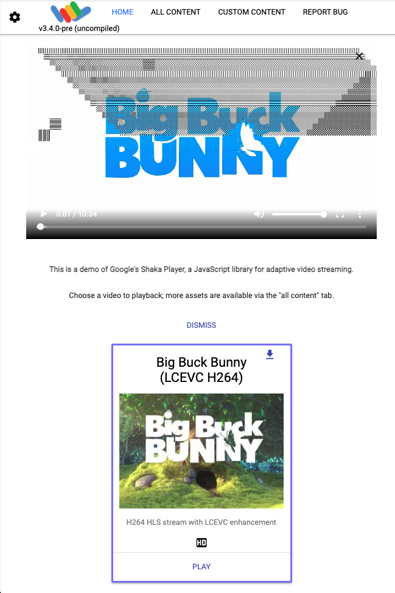

# Shaka Player LCEVC integration

# Introduction

This article describes the V-Nova LCEVC Shaka Player integration.

# LCEVC Integration

## Adding V-Nova required files
### Importing DIL - Decoder Integration Layer

V-Nova LCEVC DIL Libraries are included using the same approach that the other external libraries are currently using. The necessary V-Nova LCEVC DIL files need to be imported in the HTML page that is going to be used by Shaka Player to decode LCEVC. Checks are inplace that make sure the necessary objects are available.

Npm package : <https://www.npmjs.com/package/lcevc_dil.js>

```javascript
  <!-- MPEG-5 Part2 LCEVC support is enabled by including this: -->
  <script defer src="../node_modules/lcevc_dil.js/dist/lcevc_dil.min.js"></script>
```

To allow the Closure compiler to use the objects and methods that are exported by the DIL.js a new `extern` is created.

### Defining an Extern for LCEVC

`externs/lcevc.js` exposes the functions from the LCEVC DIL library required for LCEVC Decoding.

## Integration point

### The shaka.lcevc.Dil class - (DIL : Decoder Integration Layer)

The main logic of the LCEVC integration is located in the `lib/lcevc_dil.min.js` file. In this file the shaka.lcevc.Dil is exported to be used in the project. This class is in charge of creating the Dil object using the mentioned externs, checking if LCEVC DIL library is available, etc.

### Modifications in the player

The shaka.Player class, defined in the `lib/player.js` file, is the main player object for Shaka Player. There is a setter function for setting up a `canvas` element that is received from the user.
If shaka.ui is used the `canvas` is created in line with the video element in the same container overlaying the video element. If user provides a custom canvas using the setter function, The user is responsible for placing the canvas element in the desired position and resizing it.

`shaka.externs.LcevcConfiguration` is added to the `playerConfiguration` that is used as configuration for the LCEVC DIL Library.

The Dil object is created in the `onLoad_()` event that is triggered when a new video is loaded in Shaka Player. Attaching to a media element is defined as:

-   Registering error listeners to the media element.
-   Catching the video element for use outside of the load graph.

The Dil object is created only if LCEVC is supported (LCEVC libs are loaded on the page) and also when it was not already created in another `onLoad_()` event execution.


### Feeding the Dil

The logic that Shaka Player uses to communicate with the Media Source Extensions (MSE) is located in the `media/media_source_engine.js` file.



 `append_()` function that is used to feed the MSE Source Buffer is intercepted and modified to pass the video buffers to the LCEVC DIL Libraries before appending to the MSE Source Buffers. 

## Demo page

The relevant libraries are added in the Demo Page like so: 

```javascript
  <!-- MPEG-5 Part2 LCEVC support is enabled by including this: -->
  <script defer src="../node_modules/lcevc_dil.js/dist/lcevc_dil.min.js"></script>
```

And a new video sample with enhancement data is added to the `demo/common/assets.js` file under a new source `MPEG-5 Part 2 LCEVC`.

After these changes the demo page looks like :



          