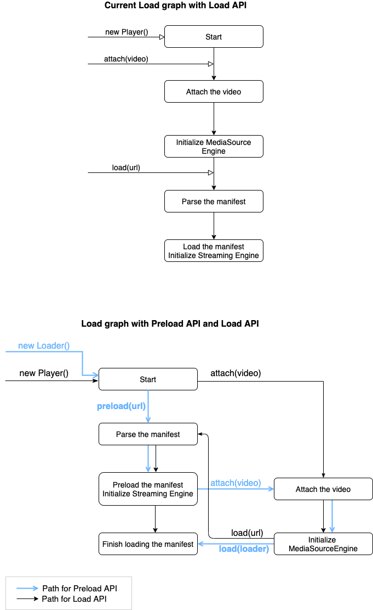

# Shaka Player Preload API Design

Last updated: 2020-03-01

by: [michellezhuo@google.com](mailto:michellezhuo@google.com)


## Objective

Enable Shaka Player to pre-load content before involving MediaSource or a
`<video>` element.

This allows an application using Shaka Player to:
- Pre-load the beginning of several pieces of video content speculatively, while
  the user is making a decision on which video to play.
- Start to play the selected video almost immediately.

[Github issue](https://github.com/google/shaka-player/issues/880)


## Background & Context

### Media Source

The [MediaSource][] API, formally known as Media Source Extensions (MSE),
provides functionality enabling plugin-free web-based streaming media. Using
MSE, media streams can be created via JavaScript, and played using `<audio>` and
`<video>` elements.

The MediaSource interface of the [Media Source Extensions API][] represents a
source of media data for an HTMLMediaElement object. A MediaSource object can be
attached to an HTMLMediaElement to be played.

The SourceBuffer interface represents a chunk of media to be passed into an
HTMLMediaElement and played, via a MediaSource object. This can be made up of
one or several media segments.

[Media Source Extensions API]:https://developer.mozilla.org/en-US/docs/Web/API/Media_Source_Extensions_API
[MediaSource]: https://developer.mozilla.org/en-US/docs/Web/API/MediaSource

### StreamingEngine & MediaSourceEngine

The StreamingEngine is the streaming component in Shaka Player. It’s responsible
for fetching the content, and pipelines the content to MediaSourceEngine.
The MediaSourceEngine manages the MediaSource and the SourceBuffers.


## Design Overview

The design will address two major requirements:
1. Enable preloading a manifest in Player before attaching to a video element
2. Enable StreamingEngine to fetch and store a segment in memory without a video
   element


## Design Goals

### Compatibility

Currently, the Shaka Player loads a manifest and streams a video via its Load
API. The Preload API should be backward compatible with the existing Load API.

An application should be able to:
- Attach a video element and load a manifest, and start playback with Shaka
  Player
- Preload manifests and attach a video element later to start playback with
  Shaka Player

### Reusability

The Preload API implementation should reuse the current Load API logic as much
as possible.


## Design Details

### Player
Currently,  with the Load API, the Player:
- must attach a `<video>` element before loading a manifest
- can load only one manifest at one time.

With the new Preload API enabled, the Player should be able to:
- pre-load a manifest, and attach a video element later to start playback.
- pre-load more than one manifest, and finish loading one of them at a time.

#### APIs

**Existing: Load API**

```js
const player = new shaka.Player();
player.attach(video);
await player.load('foo.mpd');
```
The Player constructor takes a `<video>` element (HTMLMediaElement) as an
optional parameter. If the `<video>` element is available, we attach the
`<video>` element to the player, and set up the MediaSource.

A `<video>` element must be attached to the Player before `load()` gets called.
The Player can load only one video at one time.
`load()` loads the manifest, initializes the playback components and starts
playback, including:
- Parsing the manifest
- Initializing the DRM Engine
- Attaching the playback-related listeners to the video element
- Initializing playback and observers
- Initializing ABR Manager and StreamingEngine
- Starting playback

**New: Preload API**

```js
const player = new shaka.Player();

const loader1 = player.preload('foo1.mpd');
const loader2 = player.preload('foo2.mpd');

player.attach(video);

player.load(loader1); // The buffered data in loader1 is transferred to
                      // the Player and the MediaSource. loader1 is
                      // invalidated.
loader2.destroy();    // loader2 is invalidated.
```

The new Preload API doesn’t require a `<video>` element before the Player
preloads a manifest.  The `<video>` element must be attached to the Player
before `load()` gets called.

`preload()` parses a manifest, and pipelines the manifest to the
StreamingEngine. StreamingEngine fetches the beginning piece of the content,
and stores it in memory.

The Player can preload multiple manifests in parallel, and store each of them as
a loader.


After `preload()`, `load(loader)` will start playback by opening the MediaSource
and pipelining the fetched content to MediaSourceEngine.

`load()` invalidates the loader instance once the playback starts.

After the playback starts, the application can invalidate the other loaders when
they are no longer needed by calling `destroy()`.

When the Player is destroyed, the remaining loaders will also be destroyed.

The `load()` function will take either an asset Uri or a loader instance as the
first parameter.
```js
    load(assetUri | loader, startTime, mimeType) {}
```

If `load()` gets an uri as the input, it goes to the original loading process.

If `load()` gets a loader instance, it means the content is preloaded, and the
Player goes to the following steps after preload to finish loading and start
playback.


### the Load Graph

The Player uses a state machine (the “load graph”) to go through the steps of
attaching a video element, parsing a manifest, initializing components, etc.
to start the video playback.

Currently the Player can only have one load graph, so it can only load one
manifest.

To enable preloading multiple manifests in parallel, we’ll extract the load
graph and the loading process to a Loader class. The Player can have multiple
Loader instances when preloading.

Once the user decides to load one of the manifests, the Player will invalidate
the chosen Loader passed to load(), and the Loader will be responsible for the
life cycle of loading and playback. The application can use other preloaded
Loader instances later, or invalidate them if they are no longer needed.

The load graph contains the following states (nodes):
- Attach Node
- Media Source Node
- Manifest Parser Node
- Manifest Node
- Drm Engine Node
- Load Node
- Unloading Node
- Src Equals Node

To enable the Preload API, we’ll separate the original Load Node into two nodes,
one “Preload node” and a “Load Node”. We’ll add a new path of “preload manifest
-> attach video -> load” in the graph.



#### Implementation steps

1. Extract the load graph from the Player into a Loader class.
2. The Player’s APIs should have the same behavior as before. The Player should
forward the API calls to the Loader class.
3. Add a Preload node in the Load Graph.
4. Make a path of preload manifest -> attach video -> load in the graph. We can
check if the video element is available to see which path we are on.
5. Attach the video element to the MediaSource when `load()` is called.

#### Alternative approach

To enable preloading multiple manifests, another approach is to have two load
graphs, one in the Player class and another one in the Loader class.

The load graph in Player is responsible for the overall life cycle, including
attaching / detaching the video, and parsing / loading / unloading the manifest.
the load graph in Loader is responsible for a part of the overall graph,
the parsing / loading manifest process.

However, with that approach, the life cycle of the video playback, and the
components needed for playback may be managed and accessed in two places. It may
be more complex to implement.


### StreamingEngine & MediaSourceEngine

When loading a media content, the Player initializes the MediaSource when the
StreamingEngine starts to stream a piece of content. The MediaSource gets open
once a video gets attached to it. We can append buffers to the MediaSource once
it’s open.

With the Preload API, the StreamingEngine should be able to download an
audio/video/text stream without the video element attached. The
MediaSourceEngine should be able to start without the video element, and store
the downloaded content in memory.

This way, the initialization steps of StreamingEngine, MediaSourceEngine,
MediaSource when preloading remain almost the same with the original loading
process. The state of MediaSourceEngine remains the same, and StreamingEngine
doesn't need to know the state of MediaSource. The downloaded content is kept
in and managed by MediaSourceEngine, whether stored in memory or appended to the
SourceBuffer. This approach requires the least changes in StreamingEngine and
MediaSourceEngine.

New field added to MediaSourceEngine:

`preloadBuffers_` map
- key: `contentType`
- value: an object of `{ bufferedData, mimeType }`

However, the Player can also have a MediaSourceEngine attached to a video
element, before content is loaded or preloaded.  So we won't always be able to
attach the Loader's MediaSourceEngine to a video element.

In that case, we need to replace the Loader's MediaSourceEngine with the
Player's copy, and transfer the stored buffered data.

And since MediaSourceEngine operations are sync, and StreamingEngine runs on its
own timers, we need to handle new segments being streamed while this process of
transferring buffered segments is in progress. We can pause StreamingEngine
update timers while you do the transfer.


#### Implementation Steps

When preloading:
1. When the Player initializes the MediaSourceEngine:
   1. In MediaSourceEngine, skip attaching the video to the media source for
   now. The MediaSource’s readyState is closed.
   2. In Player.onInitializeMediaSourceEngine_(), do not wait for the
   MediaSource to be open.
   3. Add a preloadBuffers map in the MediaSourceEngine.
2. When the Player initializes the StreamingEngine, and starts streaming:
   1. In `MediaSourceEngine.init()`, skip adding the SourceBuffer for now.
   Instead, store a `<contentType, { bufferedData, mimeType } >` key-value pair
   in a preloadBuffers map.

When loading with the loader instance:
1. If the Player hasn't got an attached MediaSource already, attach the video
element to the MediaSource, and the MediaSource gets open.
2. Append the buffered data to the SourceBuffers.


### Constraints
The Preload API can't work with src=. Preloading hinges on using MediaSource to
keep segments in memory and parse them later, and this can't be done with src=.


## Test Plans

### Existing use case

StreamingEngine fetches a piece of content and appends to MediaSourceEngine.
When preloading, the MediaSourceEngine appends the data to the SourceBuffer.

### New use cases

1. When preloading, the StreamingEngine fetches a piece of content and appends
   to MediaSourceEngine, and the MediaSourceEngine stores the data in memory.
2. When the MediaSource is ready, StreamingEngine pipelines the fetched content
   to the MediaSource.
3. For a live stream video, StreamingEngine can keep fetching the latest piece
   of the content. The MediaSourceEngine stores the latest data, and abandons
   the older data.