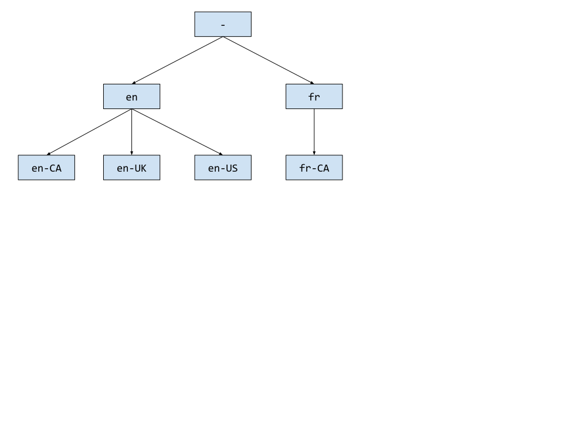

# Shaka Player - Talking About Language

## Summary
This document outlines the standard set of terms and definitions used by Shaka Player when working with language.

## Locales
A __locale__ is the top level "object" and is composed of three __components__:
 - __language__, a lowercase 2-character code. Preferably from [ISO 639](http://www.loc.gov/standards/iso639-2/php/code_list.php).
 - __region__, an uppercase 2-character code. Preferably from ISO 3166.
 - __dialect__, a lowercase n-character code.

A locale is not required to use every component but must follow one of three patterns:
 - language (e.g. "en")
 - language-REGION (e.g. "en-US")
 - language-REGION-dialect (e.g. "en-US-wa")

## Relationships
Locales follow a tree-like structure, so we use tree-like terms to talk about the relationships between locales:

 - "en" is the parent of "en-US".
 - "en-US" is the parent of "en-US-tx".
 - "en" is the grandparent of "en-US-tx".
 - "en-US" and "en-CA" are siblings.
 - "en-US-tx" and "en-US-wa" are siblings.

## Compatibility
There are three types of compatibility:
 - Locale Compatible - When two locales share the same language, region, and dialect.
  - "en" and "en"
  - "en-US" and "en-US"
  - "en-US-wa" and "en-US-wa"
 - Region Compatible - When two locales share the same language and region.
  - "en-US" and "en-US"
  - "en-US" and "en-US-wa"
  - "en-US-wa" and "en-US-tx"
 - Language Compatible - When two locales share the same language.
  - "en-US" and "en-US"
  - "en-US" and "en-CA"
  - "en-US-wa" and "en-US-tx"
  - "en-US-wa" and "en-CA-mb"
  - "en" and "en-US-wa"
  - "en-US" and "en-US-wa"

