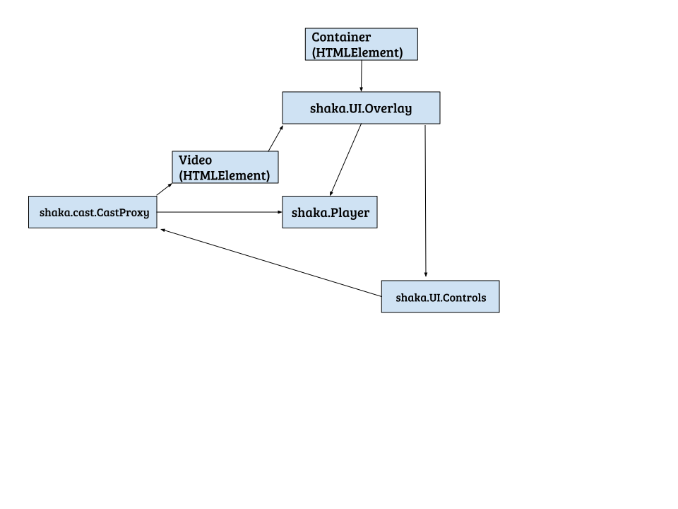

# Shaka UI Library Design

## Overview

Shaka UI is a customizable, easy to set up UI layer for Shaka Player with built-in
accessibility and localization support. It provides a default set of video controls
that are visually similar to Chrome native controls and can be added to an application
with just one line of code and styled through CSS. Using the UI API, the UI can be
customized to better meet applications' needs.

UI layer is a part of the default Shaka build, but can be excluded from the build by
applications.


## Player-UI relationships

Arrows signify ownership (`shaka.UI.Overlay` -> `shaka.Player` mean that
`shaka.UI.Overlay` class has a `shaka.Player` field).



The following statements are true:
```js
container.ui == video.ui
castProxy.video == video
castProxy.player == ui.player
```

For details on adding Shaka UI to your application, see [UI library tutorial].

[UI library tutorial]: https://uipreview-dot-shaka-player-demo.appspot.com/docs/api/tutorial-ui.html
